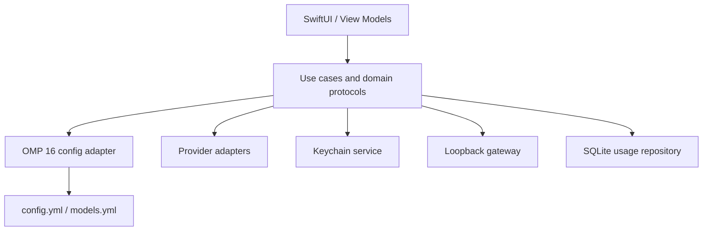

# Architecture

OMP API Manager is a native macOS 14+ SwiftUI application with a testable core library. Views only render state and invoke use cases; they do not invoke processes, mutate YAML, access Keychain, or query storage.

## Modules

- `OMPAPIManagerApp`: composition root and SwiftUI shell.
- `OMPAPIManagerCore/Domain`: immutable models, errors, and protocols.
- `Infrastructure/OMP`: installation discovery, semantic YAML tree, atomic transaction store, and version-specific adapter.
- `Infrastructure/Providers`: protocol-specific endpoint validation and transport.
- `Infrastructure/Keychain`: macOS Keychain wrapper. API key values never enter persistence models.
- `Services`: pure business calculations such as cost estimation.

## Security boundaries

API secrets are stored using `kSecClassGenericPassword` under `com.omp-api-manager`, with account names such as `provider.<id>`. Config files contain a Keychain command reference, never a plaintext key. All diagnostics must redact authorization, query key, and secret header values. The future gateway binds only to `127.0.0.1` and uses a separate random local bearer token.

## Compatibility boundary

`OMPConfigAdapter` isolates OMP schema behavior. `OMP16ConfigAdapter` supports only documented OMP 16.x paths. Unknown OMP versions must be read-only. Provider protocol differences are isolated behind `ProviderAdapter`.

## Local database

The SQLite usage repository is owned by infrastructure, never views. It stores sanitized `usage_records` with timing, status, provider/model identifiers, provider-reported token metadata, and usage source. API keys, prompt bodies, response bodies, and authorization headers are excluded by schema. Provider metadata is stored separately from its Keychain account credential.

## Gateway data flow

The loopback listener authenticates a request with a distinct local token, looks up the upstream credential in Keychain, forwards it to the selected provider, then stores redacted metrics. Standard responses and SSE byte chunks pass through without persistence. Final usage is extracted only when the provider supplies it.

## MVP implementation status

Implemented: installation discovery, documented directory resolution, read-only configuration inspection UI, semantic YAML read/update transaction, conflict detection, backups, OMP 16 adapter, Keychain wrapper, validated Keychain-backed provider drafts, OpenAI/Anthropic model discovery and connection testing, loopback SSE gateway, sanitized SQLite usage persistence, usage dashboard/export, and unit/integration tests.

Planned: configuration diff and retention controls, multi-provider gateway profiles, UI automation, signing/notarization, and packaged distribution.
