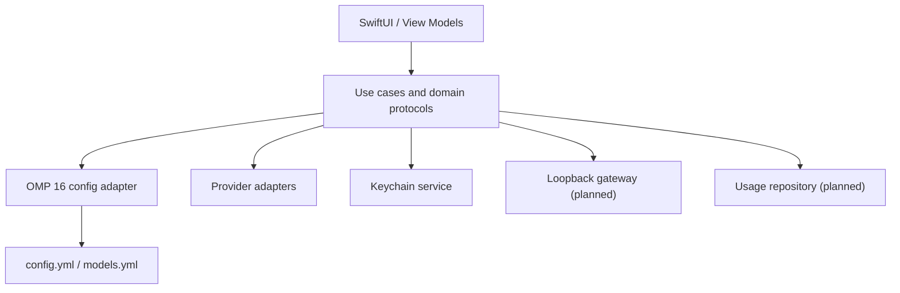

# Architecture

OMP API Manager is a native macOS 14+ SwiftUI application with a testable core library. Views only render state and invoke use cases; they do not invoke processes, mutate YAML, access Keychain, or query storage.

## Modules

- `OMPAPIManagerApp`: composition root and SwiftUI shell.
- `OMPAPIManagerCore/Domain`: immutable models, errors, and protocols.
- `Infrastructure/OMP`: installation discovery, semantic YAML tree, atomic transaction store, and version-specific adapter.
- `Infrastructure/Providers`: protocol-specific endpoint validation and transport.
- `Infrastructure/Keychain`: macOS Keychain wrapper. API key values never enter persistence models.
- `Services`: pure business calculations such as cost estimation.

## Security boundaries

API secrets are stored using `kSecClassGenericPassword` under `com.omp-api-manager`, with account names such as `provider.<id>`. Config files contain a Keychain command reference, never a plaintext key. All diagnostics must redact authorization, query key, and secret header values. The future gateway binds only to `127.0.0.1` and uses a separate random local bearer token.

## Compatibility boundary

`OMPConfigAdapter` isolates OMP schema behavior. `OMP16ConfigAdapter` supports only documented OMP 16.x paths. Unknown OMP versions must be read-only. Provider protocol differences are isolated behind `ProviderAdapter`.

## Planned local database

The future GRDB/SQLite repository will be owned by infrastructure, never views. Initial migrations will create `providers` (non-secret metadata and Keychain account reference), `models` (capabilities/prices/source timestamps), `usage_records` (sanitized timing/status/token metrics and source), and `budgets`. Foreign keys will reference opaque provider and model identifiers. API keys, prompt bodies, response bodies, and authorization headers are excluded by schema.

## Gateway data flow

The planned loopback listener authenticates an OMP request with a distinct local token, looks up the upstream credential in Keychain, translates with the selected `ProviderAdapter`, forwards the response, then stores redacted metrics. For streaming responses, final usage is extracted only from the final provider event when supplied. The original response stream passes through unchanged.

## MVP implementation status

Implemented: installation discovery, documented directory resolution, read-only configuration inspection UI, semantic YAML read/update transaction, conflict detection, backups, OMP 16 adapter, Keychain wrapper, validated Keychain-backed provider drafts, a minimal OpenAI-compatible models request, cost calculator, SwiftUI shell, and unit tests.

Planned: provider CRUD persistence, Anthropic adapter, full connection requests, loopback streaming gateway, SQLite usage repository, dashboard, export, UI tests, and release packaging.
