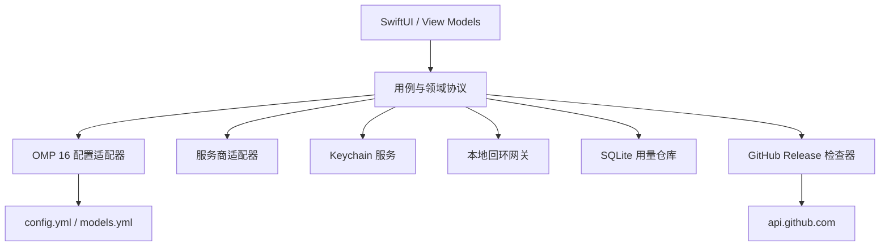

# 架构

> 语言： [English](../architecture.md) | **简体中文**

OMP API Manager 是一个面向 macOS 14+ 的原生 SwiftUI 应用，带有可测试的核心库。视图只渲染状态并调用用例；不会直接执行进程、修改 YAML、访问 Keychain 或查询存储。

## 模块

- `OMPAPIManagerApp`：组合根与 SwiftUI 界面。
- `OMPAPIManagerCore/Domain`：不可变模型、错误和协议。
- `Infrastructure/OMP`：安装发现、语义 YAML 树、原子事务存储和版本专属适配器。
- `Infrastructure/Providers`：协议专属的端点验证与传输。
- `Infrastructure/Keychain`：macOS Keychain 封装；API Key 不会进入持久化模型。
- `Services`：成本估算和由用户手动触发的软件更新检查等业务用例。

## 安全边界

API 密钥使用 `kSecClassGenericPassword` 保存在 `com.omp-api-manager` 服务下，账户名类似 `provider.<id>`。配置文件只包含 Keychain 命令引用，绝不包含明文密钥。所有诊断信息必须脱敏授权、查询密钥和秘密请求头。网关只绑定 `127.0.0.1`，并使用独立的随机本地 Bearer Token。

## 兼容性边界

`OMPConfigAdapter` 隔离 OMP Schema 行为。`OMP16ConfigAdapter` 只支持已记录的 OMP 16.x 路径。未知 OMP 版本必须只读。协议差异由 `ProviderAdapter` 隔离。

## 本地数据库

SQLite 用量仓库由基础设施层拥有，而不是视图层。它保存经过脱敏的 `usage_records`：耗时、状态、服务商/模型标识、服务商报告的 Token 元数据和用量来源。Schema 排除 API Key、提示词、响应正文和授权头。服务商元数据与其 Keychain 账户凭据分开存储。

## 网关数据流

回环监听器使用独立的本地令牌认证请求，从 Keychain 取得上游凭据，转发到选定的服务商，然后写入脱敏指标。普通响应和 SSE 字节块会直接透传而不持久化。只有服务商提供最终用量时才会提取用量。

## 软件更新边界

更新检查只由用户主动触发，并且只访问固定的公开 GitHub Releases 端点。核心层会验证正式语义版本标签、在本地构造官方 Release URL，并把展示状态返回给应用。请求不会携带 GitHub Token 或本地应用数据。由于当前构建仍为 ad-hoc 签名且未公证，应用只会打开官方 Release 页面，不会自动下载或安装更新。

## MVP 实现状态

已实现：安装发现、目录解析、只读配置检查 UI、语义 YAML 读写事务、冲突检测、备份、OMP 16 适配器、Keychain 封装、经过验证的 Keychain 服务商草稿、OpenAI/Anthropic 模型发现与连接测试、SSE 网关、脱敏 SQLite 用量持久化、用量仪表盘/导出、手动 GitHub Release 检查，以及单元/集成测试。

计划中：配置差异与保留控制、多服务商网关配置、UI 自动化、签名/公证和打包分发。
